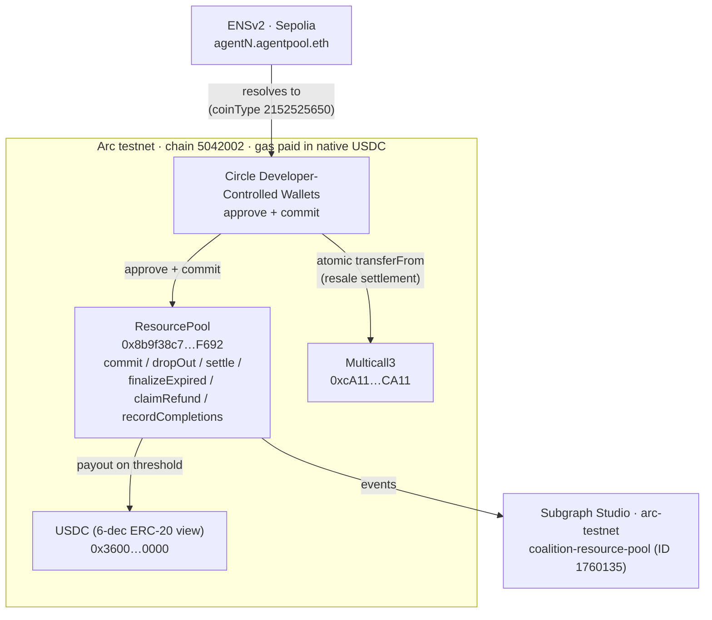

# ARC.md: Circle DeFi + Circle Agentic Economy submission receipt

> **Judge orientation:** [JUDGES.md](JUDGES.md) gives the short system story
> and code-first evaluation route. This document is the Arc/Circle evidence
> record: deployment facts, product usage, reproducibility, and limitations.

**Overall: Arc is load-bearing, not cosmetic.** Coalition settles its N-agent
pooling contract (`ResourcePool`) on Arc testnet, moves USDC through Circle
Developer-Controlled Wallets, settles a resale buy as one atomic Multicall3 USDC
aggregate.
Gas is paid in native USDC. This single receipt covers four Circle-track
submissions built on the same Arc deployment: the ETHOnline 2026 Arc partner
slot (**Circle DeFi** and **Circle Agentic Economy**, §1–§9), plus two
separately-named bounties evaluated against the same repo — **Best
DeFi/Onchain Finance Application** (§10) and **Best Agentic Economy
Application with Circle Agent Stack** (§11).

Note on wallets: Circle Developer-Controlled Wallets are a **Circle Wallets**
product, and Circle Wallets is listed as its own core product on both the
DeFi/Onchain Finance and Agentic Economy bounty pages — separate from the
Circle **Agent Stack** line (the 2-of-2 MPC Agent Wallet product). DCW usage
counts as in-scope Circle Wallets evidence for every track below; only the
Agent Stack-branded Agent Wallet path is the piece that was not shipped (§7,
§9, §11).

Repo is PUBLIC: https://github.com/Jashk120/Coalition.

## 1. Qualification fit (per track requirement)

| # | Requirement | Verdict | Evidence |
|---|---|---|---|
| 1 | Working frontend + backend + reusable SDK | PASS | `app/` (Next.js dashboard), `orchestrator/` (Go service, stdlib only), `sdk/` (`@jx-nexus/coalition`, consumed by the app via `file:../sdk`) |
| 2 | Custom `ResourcePool` (N-way threshold pooling) | PASS (live) | `contracts/src/ResourcePool.sol`; deployed at `0x8b9f…F692` on Arc testnet, deploy tx `0xb314…a279` (§3) |
| 3 | Agent-initiated USDC transactions | PASS via Circle Developer-Controlled Wallets | `POST /api/agents/fund` drives DCW `approve` + `commit` on Arc; no local keys and no self-custody path (§4.1) |
| 4 | Circle App Kit "where relevant" | PASS | `POST /api/agents/treasury` uses App Kit `kit.send` to re-fund agents on Arc Testnet (§4.2) |
| 5 | Circle Contracts (Smart Contract Platform) | PASS | `app/deploy-pool-circle.mjs` deploys `ResourcePool` through Circle Contracts on `ARC-TESTNET` (§4.3) |
| 6 | x402 / Nanopayments resale rail as a complement | PASS (server-side) | `POST /api/resale/quota` settles through Circle Gateway middleware on `eip155:5042002`; the atomic buyer settlement itself is Multicall3 + USDC (§4.4, §4.5) |
| 7 | Public GitHub repo + receipt | PASS | Repo public; this file |
| 8 | Demo video | PENDING | Not yet published (§9) |
| 9 | Architecture diagram | PASS | §2 |
| 10 | Business narrative | PASS | §8 |

## 2. Architecture at a glance

Identity/discovery is ENSv2 (§`ENS.md`), indexing is The Graph (§`GRAPH.md`), and
Arc is the settlement and wallet layer documented here.

## 3. Arc deployment facts

| Fact | Value |
|---|---|
| Network | Arc testnet |
| Chain id / CAIP-2 | `5042002` / `eip155:5042002` |
| RPC (canonical) | `https://rpc.testnet.arc.io` (viem preset carries `rpc.testnet.arc.network` as fallback) |
| Explorer | `https://testnet.arcscan.app` |
| Faucet | `https://faucet.circle.com` |
| Gas token | Native USDC, 18 decimals (ERC-20 view of the same balance: 6 decimals) |
| USDC (ERC-20, pool token) | `0x3600000000000000000000000000000000000000` |
| Arc ENS coin type | `2152525650` (`0x80000000 \| 5042002`) |
| `ResourcePool` (current) | `0x8b9f38c7B005Dd67203e27240F45335a9e64F692` |
| Pool deploy tx | `0xb314fdfeeb9a873b84fa90f9ab38126e30d1ccbebf80375227f73d5a5271a279` |
| Pool deploy block | `61221987` (2026-09-09T10:09:42Z) |
| Deployer | `0x78F31B03De0E6473db80f2Da8c1a1cf5DB44A42a` |
| Provider (settle payee) | `0x0a6415E892972214BCEb0271746CB45932F7EaF1` (agent-4 / funder 4) |
| Target | `10000000` atomic = 10.00 USDC |
| `maxParticipants` / cap | `4` / `10` |
| `resourceURI` | `ipfs://coalition-v2-judges` |
| Multicall3 | `0xcA11bde05977b3631167028862bE2a173976CA11` |
| Circle GatewayWallet (testnet) | `0x0077777d7EBA4688BDeF3E311b846F25870A19B9` |
| Circle Gateway facilitator | `https://gateway-api-testnet.circle.com` |

The `ResourcePool` constructor order matches `app/deploy-pool-circle.mjs`.

## 4. Circle products used

### 4.1 Circle Developer-Controlled Wallets — agent funding

- Package: `@circle-fin/developer-controlled-wallets` (`app/package.json`).
- Helper: `app/lib/circle-fund.ts` — `initiateDeveloperControlledWalletsClient`,
  `createContractExecutionTransaction`, `getTransaction`, `getWallet`, wrapped by
  `executeContractAndWait` (submits, polls to CONFIRMED/COMPLETE, 120s timeout).
- Route: `POST /api/agents/fund` (`app/app/api/agents/fund/route.ts`). Phase 1
  attests each funder against its ENS subname (`funderWallet === ENS wallet`);
  phase 2 fires the USDC `approve(address,uint256)` calls; phase 3 commits
  strictly sequentially with `commit(uint256)` / `commit(uint256,uint256)`.
- Env (server-only): `CIRCLE_API_KEY`, `CIRCLE_ENTITY_SECRET`,
  `CIRCLE_WALLET_IDS`, `CIRCLE_PROVIDER_WALLET_ID`, `CIRCLE_BUYER_WALLET_ID`.
- Custody: Circle co-signs; there are no local keys and no `seed-keys.ts` /
  `SEED_PRIVATE_KEYS` path in the repository.

### 4.2 Circle App Kit — treasury re-funding rail

- Packages: `@circle-fin/app-kit`, `@circle-fin/adapter-circle-wallets`.
- Helper: `app/lib/appkit.ts` — `new AppKit()`, `createCircleWalletsAdapter`,
  `kit.send({ from, to, amount, token: "USDC" })` on App Kit chain `Arc_Testnet`.
- Route: `POST /api/agents/treasury` tops each agent wallet up to
  `CIRCLE_TREASURY_FUND_USDC` (default 2.50) only when its on-chain balance is
  below target, so it is idempotent. App Kit cannot call arbitrary contracts, so
  `approve` + `pool.commit` stays on the DCW path (§4.1).
- Env (server-only): `CIRCLE_TREASURY_WALLET_ID`, `CIRCLE_TREASURY_FUND_USDC`.

### 4.3 Circle Contracts (Smart Contract Platform) — deployment

- Package: `@circle-fin/smart-contract-platform`.
- Script: `app/deploy-pool-circle.mjs` — `initiateSmartContractPlatformClient`,
  `deployContract({ blockchain: "ARC-TESTNET", walletId, abiJson, bytecode,
  constructorParameters })`, then `getContract` polling to `COMPLETE`. Foundry
  stays the compiler; `contracts/foundry.toml` pins `evm_version = "paris"`
  so Circle Contracts accepts the bytecode.
- Env: `CIRCLE_DEPLOYER_WALLET_ID` (defaults to `CIRCLE_PROVIDER_WALLET_ID`).

### 4.4 Circle Gateway + x402 — resale quota leg

- Packages: `@circle-fin/x402-batching` (server middleware), `@x402/core`,
  `@x402/evm`.
- Route: `POST /api/resale/quota` — `createGatewayMiddleware({ sellerAddress,
  networks: ["eip155:5042002"], facilitatorUrl:
  "https://gateway-api-testnet.circle.com" })`. Unpaid callers get `402` +
  `PAYMENT-REQUIRED`; paid callers get `{ settlementId, amountAtomic, seller }`,
  where `settlementId` is the Gateway settle transaction surfaced by the
  middleware (`app/app/api/resale/quota/route.ts`). The orchestrator
  `/transfer-quota` verifies that settlement id.
- `app/lib/constants.ts` carries the rail config: `RESALE_NETWORK`
  (`eip155:5042002`), `RESALE_FACILITATOR_URL`, `RESALE_GATEWAY_WALLET`.

### 4.5 Multicall3 atomic resale settlement (with DCW)

- Helper: `app/lib/resale-execute.ts` (`executeResaleBuy`) — buyer USDC
  `approve(address,uint256)` to Multicall3, then one
  `aggregate((address,bytes)[])` of `transferFrom` payout legs
  (`app/lib/resale.ts` `buildSettlementCalls`), then the orchestrator
  `/commit-mint` against that single settlement hash.
- Buyer wallet: `CIRCLE_BUYER_WALLET_ID` (agent-5, held out of
  `CIRCLE_WALLET_IDS`), paid from its own on-chain USDC balance — no Gateway
  deposit is needed for this path.

## 5. Contract methods and parameters

Funding and lifecycle calls are issued through Circle DCW contract execution
(`abiFunctionSignature` + decimal-string `abiParameters`):

| Call | Signature | Params |
|---|---|---|
| Approve | `approve(address,uint256)` | USDC `0x3600…0000`, amount in 6-dec atomic |
| Commit (v1 shim) | `commit(uint256)` | amount |
| Commit (v2 round) | `commit(uint256,uint256)` | roundId, amount |
| Start round | `startRound(uint256,uint64,uint256)` | target, durationSec, maxParticipants |
| Finalize expired | `finalizeExpired(uint256)` | roundId |
| Resale settlement | `aggregate((address,bytes)[])` | one `transferFrom(buyer, seller, amount)` per fill-plan output, wallet-asc |

The pool also exposes `dropOut`, `settle`, `claimRefund`, and
`recordCompletions`; the single-argument v1 overloads forward to the current round.
The happy path needs no separate `settle` call: the commit that fills the target
pays the provider inline and emits both `Settled(uint256)` and
`Settled(uint256,uint256)`.

## 6. Live verification

- **Deploy receipt (Arc).** `ResourcePool` at `0x8b9f…F692`, deploy tx
  `0xb314…a279`, block `61221987`, from `0x78F3…A42a`
  (`contracts/broadcast/Deploy.s.sol/5042002/run-latest.json`).
- **Indexed pool state (2026-09-11).** Via the `arc-testnet` subgraph
  (`_meta.hasIndexingErrors = false`, `_meta.block.number = 61567239`): one
  `Pool` (`0x8b9f…F692`), target `10000000`, `totalCommitted` `110000000`,
  `settled` `true`, `participantCount` `47`, 47 commitments, 0 dropouts. Full
  query and reproduce steps are in `GRAPH.md` §3.
- **ENS ↔ Arc wallet (2026-09-11).** All four `agentN.agentpool.eth` subnames
  resolve to the Circle funder wallets via `cast` against Sepolia, independent
  of the repo's earlier receipts (`ENS.md` §3).
- **Circle credentials.** The Circle environment is server-only; missing
  `CIRCLE_*` env returns a 503 with a setup hint rather than a partial run
  (`app/lib/circle-fund.ts`).

Re-query the subgraph and explorer at demo time; counts move as the pool does.

## 7. Feature map

| Feature | Status | Coalition usage |
|---|---|---|
| Arc testnet (chain 5042002) | USED | `ResourcePool`, USDC, native-USDC gas, dual-decimal handling in `sdk/src/chains/` |
| Native USDC gas (18-dec native / 6-dec ERC-20) | USED | All on-chain amounts are `bigint` atomic; `toAtomicUsdc` / `fromAtomicUsdc` keep the 10¹² gap explicit |
| Custom `ResourcePool` | USED (live) | `0x8b9f…F692` |
| Circle Developer-Controlled Wallets (Circle Wallets product) | USED (live) | Agent funding, resale buyer, deployer, treasury source; counts as Circle Wallets evidence for §10/§11, distinct from Agent Stack below |
| Circle App Kit | USED | Treasury `kit.send` re-funding rail |
| Circle Contracts (SCP) | USED | `deploy-pool-circle.mjs` |
| Circle Gateway / x402 | USED (server-side) | `POST /api/resale/quota` per-seller 402 + settlement id |
| Multicall3 atomic resale | USED | `executeResaleBuy` aggregate settlement |
| Circle Agent Stack *Agent Wallets* (2-of-2 MPC) | NOT USED | Documented in planning but not shipped; Developer-Controlled Wallets (Circle Wallets, above) are the working custody path instead |
| Circle Nanopayments / Paymaster | NOT USED | The resale rail uses Circle Gateway + x402 for the quota leg, not the Nanopayments or Paymaster products by name |
| Circle wallet policies | NOT USED | `wallet limit` is mainnet-only; pool-address checks and caps are enforced in the contract/SDK instead |
| Agent Marketplace | NOT USED | Discovery runs through ENS + The Graph |
| ERC-8183 escrow | NOT USED | Its 1:1:1 model cannot express N-way pooling; `ResourcePool` is the only custom escrow |

## 8. Business narrative

Agent infrastructure is priced for a single user but used by many partial ones:
an H100 at roughly $20/hr is wasted on one agent that consumes a fraction of it.
Coalition lets a fleet of agents pool USDC on Arc toward one shared resource,
settle atomically to the provider at the threshold, and refund everyone if the
target is missed; an agent that drops out after committing forfeits its stake
to the rest. Because equal payment is not equal usage, an outside agent can buy
the spare capacity through the resale rail, compensating the most-overpaying
participants until the pool's cost-to-compute ratios trend back toward 1:1. Arc
supplies the settlement layer (gas in USDC, sub-second finality), and Circle
supplies agent-controlled USDC custody and App Kit movements — the pieces a
multi-agent pooling protocol needs and should not rebuild.

## 9. Scope and limitations

- Agent funding uses **Circle Developer-Controlled Wallets**, not Circle Agent
  Stack Agent Wallets. The Agent Wallet path (2-of-2 MPC, `circle` CLI skills)
  is documented but was not shipped; do not present it as live.
- Circle **wallet policies** are mainnet-only and are not used on testnet; the
  pool enforces contribution caps on-chain instead.
- **No Arc pool funding/settle/resale transaction hashes are checked into the
  repo.** Live funding evidence lives in the subgraph's `Commitment` /
  `Settlement` entities (`GRAPH.md` §3); re-query the subgraph and explorer at
  demo time.
- The x402/Gateway rail covers the server-side resale quota leg; the buyer's
  actual settlement is a DCW + Multicall3 aggregate, not an x402 payment.
- `app/lib/constants.ts` still carries the earlier v1 pool address
  (`0xC6f9…B4fd`) as a code fallback; the live deployment and every checked-in
  config point at `0x8b9f…F692` (`.env.example`, subgraph manifest, deploy
  broadcast). Read `NEXT_PUBLIC_POOL_ADDRESS` from env as the source of truth.
- The demo video and live demo URL are not yet published.

## 10. Best DeFi/Onchain Finance Application — submission fit

| # | Requirement | Verdict | Evidence |
|---|---|---|---|
| 1 | Meaningful use of Arc and USDC | PASS | `ResourcePool` locks, settles, and refunds in USDC on Arc; gas paid in native USDC (§3) |
| 2 | Advanced programmable money flows (conditional payments, onchain automation, multi-step settlement) | PASS | `ResourcePool` commit is threshold-conditional (settle inline on fill, refund on expiry, §5); resale is a Multicall3 atomic multi-leg USDC settlement (§4.5) |
| 3 | Payment/liquidity/treasury workflows using App Kits where relevant | PASS | App Kit treasury re-funding rail, `kit.send` (§4.2) |
| 4 | Circle Wallets / Circle Contracts as core products | PASS | Developer-Controlled Wallets drive funding and resale (§4.1); Circle Contracts deploys the pool (§4.3) |
| 5 | Shows why stablecoin-native infra changes what's possible | PASS (narrative) | §8's pooling economics; frame for this track as shared-treasury infrastructure rather than agent-identity infrastructure |
| 6 | Functional MVP + architecture diagram | PASS | `app/` + `orchestrator/` + `contracts/`; diagram in §2 |
| 7 | Video demonstration + presentation | PENDING | Not yet published |
| 8 | Public GitHub repo | PASS | https://github.com/Jashk120/Coalition |

CCTP, Gateway (the two-way version, not just the resale quota leg), and
StableFX are listed as core products for this track but are not currently
used anywhere in the repo; the submission narrative should lean on
ResourcePool + DCW + App Kit + Circle Contracts, not claim these three.

## 11. Best Agentic Economy Application with Circle Agent Stack — submission fit

| # | Requirement | Verdict | Evidence |
|---|---|---|---|
| 1 | Agents with clear decision logic tied to real signals | PASS | Resale agent (agent-5) decides via `getPoolHealth` from the subgraph and fails closed to `skip` when that read is unavailable (`GRAPH.md` §10) |
| 2 | Autonomous spending, payments, or settlement flows using USDC | PASS | `POST /api/agents/fund` drives DCW `approve` + `commit`; resale settles via the Multicall3 aggregate (§4.1, §4.5) |
| 3 | Use of Agent Stack to connect agents to wallets, USDC payments, onchain actions | PARTIAL | Wallet custody is Circle Developer-Controlled Wallets — a **Circle Wallets** product, separately listed as a core product for this track — not the Circle **Agent Stack** 2-of-2 MPC Agent Wallet product specifically; that path is documented but not shipped (§7, §9) |
| 4 | Use of Nanopayments, Paymaster, or App Kits for agent-to-agent/service payments | PARTIAL | App Kit is used for treasury re-funding (§4.2); the resale rail uses Circle Gateway + x402 for the quota leg, which is nanopayment-adjacent but is not the Nanopayments or Paymaster product by name |
| 5 | Functional MVP + architecture diagram | PASS | Same evidence as §10 |
| 6 | Video demonstration + presentation | PENDING | Not yet published |
| 7 | Public GitHub repo | PASS | https://github.com/Jashk120/Coalition |

Honest framing for this track specifically: the agent-to-agent economics are
real and load-bearing — pooling, dropout forfeiture, and resale are all live or
Forge-tested — and the wallet custody genuinely is Circle infrastructure
(Developer-Controlled Wallets under Circle Wallets).
What is not present is the Agent Stack-branded 2-of-2 MPC Agent Wallet
product itself, which is the product this bounty is named after. A judge
scoring strictly on "did you use Agent Stack" should mark item 3 partial; a
judge scoring on "do agents transact using Circle-issued wallet
infrastructure and USDC" should count DCW. Do not present the Agent Wallet
path as shipped in the submission write-up — §9's existing caveat already
says this and should carry over verbatim into this track's write-up.
