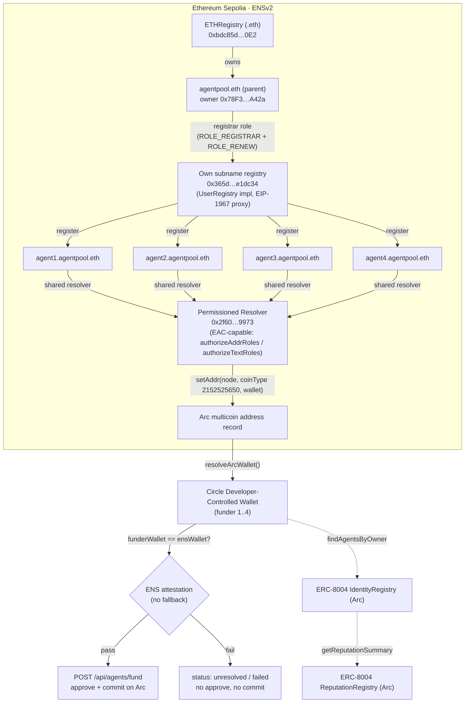

# ENS.md: Best Use of ENSv2 submission receipt

**Overall: ENS is central and load-bearing.** Funding is gated
on `funderWallet == ENS wallet` (see §7b). Resolution was re-verified
2026-09-11 via `cast` against
`https://ethereum-sepolia-rpc.publicnode.com`, independent of the repo's
earlier receipts. EAC grant/revoke has not been exercised live. The demo
video and live demo URL are not yet published (§8).

Repo is PUBLIC: https://github.com/Jashk120/Coalition (verified via GitHub
API: `private=false`). ENS commits are in `origin/main`.

## 1. Qualification fit (per requirement)

| # | Requirement | Verdict | Evidence |
|---|---|---|---|
| 1 | Built on ENSv2 Sepolia deployment | PASS (code + live) | `sdk/src/ens/addresses.ts`; all reads target Sepolia via viem `sepolia` client (`sdk/src/ens/client.ts`); live resolution verified 2026-09-10 and re-verified 2026-09-11 via `https://ethereum-sepolia-rpc.publicnode.com` (§3) |
| 2 | Subname registry + EAC central to identity flow, resolving to Arc wallet to ERC-8004, not hardcoded | PASS on resolution and registry, AVAILABLE on EAC (not exercised live) | Scored path `resolveEnsToAgents` (subname to Arc wallet to agent ids) verified live for all 4 subnames 2026-09-11 with no fallback; own subname registry USED (§2, §5); EAC selectors present in resolver bytecode but no live grant exercised (§4) |
| 3 | Central, not cosmetic | PASS | ENS gates `GET /api/agents`, `POST /api/agents/run`, and `POST /api/agents/fund` (§7b); unresolved seeds get no wallet and cannot run or fund |
| 4 | Public repo + ENS.md receipt (Sepolia addresses, EAC roles) | PASS on receipt, PASS on visibility | This file; repo public at https://github.com/Jashk120/Coalition, ENS commits in `origin/main` |
| 5 | Video OR live demo | PENDING | Not yet published; §8 carries the recording plan |
| 6 | Beta caveats on record | PASS | §9 below |

The identity and attestation path — subname registry to Arc wallet to the funding gate:



## 2. Sepolia addresses used

Source of truth: `docs.ens.domains/learn/deployments/#sepolia-ensv2-beta` +
`contracts/deployments/sepolia/*.json` in `ensdomains/contracts-v2`.
Last checked against docs: **2026-09-07**.
Live re-verification: **2026-09-11** via `cast` (§3 method).
Re-check: **at demo time**; every literal below is overridable per SDK call.

| Contract | Address | Status |
|---|---|---|
| UniversalResolver proxy | `0xeEeEEEeE14D718C2B47D9923Deab1335E144EeEe` | Docs-table literal; used for reads via viem `sepolia` preset |
| ETHRegistry (`.eth`) | `0xbdc85DD5b15D7ecb354cd7cb6f2c50b4f2c4F0E2` | Docs-table literal; USED as the `.eth` registry. `agentpool.eth` is REGISTERED here: `getState(keccak("agentpool"))` returns status 2, owner `0x78F31B03De0E6473db80f2Da8c1a1cf5DB44A42a`, expiry 1978259976 |
| ETHRegistrar | `0xa88553f454b77203b0d036a05c894d555eaaa2cc` | Docs-table literal; not used as the subname registry |
| RootRegistry | `0x8115186e8f2e0b0281e86ab91f0f48ba90364354` | Docs-table literal; reference only, not in the scored path |
| Parent subname registry (own, hierarchical) | `0x365d676b7B95cf9c9E76531C8ab5bCEaD0e1dc34` | LIVE as-built. EIP-1967 proxy; implementation slot = `0x624a25d67B59D587752EbEc8DdeD8827dAe52050` = official UserRegistry implementation. All 4 subnames are status 2 REGISTERED here. NOT the docs-table ETHRegistry literal |
| UserRegistry impl (slot value above) | `0x624a25d67B59D587752EbEc8DdeD8827dAe52050` | Docs-table literal; USED as the implementation behind the parent subname registry proxy |
| Shared Permissioned Resolver (all 4 subnames + parent) | `0x2f60a75E4Dcd037110a8feaAB4b15f57B2BB9973` | LIVE as-built. EIP-1967 proxy; implementation slot = `0x9EAe5C2730a7dD16BDD1DeE6421a1B91e3B0365e` = official PermissionedResolverImpl. Single shared instance, not per-subname (see §5) |
| PermissionedResolver impl (slot value above) | `0x9EAe5C2730a7dD16BDD1DeE6421a1B91e3B0365e` | Docs-table literal; USED as the implementation behind the shared resolver proxy |
| VerifiableFactory | No default exported on purpose | Rotated already; re-fetch from `sepolia/*.json`. Factory address and generation that deployed `0x365d…e1dc34` are not yet recorded |
| MockUSDC (mintable, 6-dec) | No default exported on purpose | Rotated already; re-fetch before use |
| Parent `agentpool.eth` token/owner | Parent resolves on Sepolia (resolver set, no Arc record as expected) | Owner `0x78F31B03De0E6473db80f2Da8c1a1cf5DB44A42a`, status 2, expiry 1978259976, verified 2026-09-11 in ETHRegistry `0xbdc85d…0E2` |
| Per-subname resolver instances | NOT USED; shared resolver observed | §5 records the as-built (shared) vs as-specified (per-subname) gap |

Cross-chain constants: Arc chain `5042002`, `ARC_COIN_TYPE = 2152525650`
(`0x80000000 | 5042002`, ENSIP-9/11; asserted vs `toCoinType(5042002)` in
`sdk/test/ens.test.ts`).

## 3. Names: parent + 4 subnames

Wallets are Circle Developer-Controlled Wallets read from `CIRCLE_WALLET_IDS`
(index `i` maps to `SEED_META[i].ensName`, i.e. funder 1..4 = agent1..4). There
is no self-custody path: `app/lib/seed-keys.ts` is deleted,
`~/.coalition/seed-keys.json` is deleted, and `SEED_KEYS_FILE` is no longer
used. Nothing here signs with a local key. `agentId` is `null` in seeds and is
filled at runtime via `registerAgent`. Live resolution is re-verified below.

| Name | Arc wallet | Registry state | Expiry (unix) | Resolver | ERC-8004 agentId |
|---|---|---|---|---|---|
| `agentpool.eth` (parent) | None (operator-owned) | Status 2 REGISTERED in ETHRegistry `0xbdc85d…0E2`; owner `0x78F31B03De0E6473db80f2Da8c1a1cf5DB44A42a` | 1978259976 | `0x2f60a75E4Dcd037110a8feaAB4b15f57B2BB9973` | None |
| `agent1.agentpool.eth` | `0x4f188f3da697984f0fc02e61fda4a34b00abf39a` | Status 2 REGISTERED in `0x365d…e1dc34` | 1820412108 | `0x2f60a75E4Dcd037110a8feaAB4b15f57B2BB9973` | Runtime (unverified) |
| `agent2.agentpool.eth` | `0x8c4d4ca5fe56c4aef3e7b424879f25693e9d5a2b` | Status 2 REGISTERED in `0x365d…e1dc34` | 1820412108 | `0x2f60a75E4Dcd037110a8feaAB4b15f57B2BB9973` | Runtime (unverified) |
| `agent3.agentpool.eth` | `0xde086aa43915670c74444b3e5a464d992e1f7770` | Status 2 REGISTERED in `0x365d…e1dc34` | 1820412108 | `0x2f60a75E4Dcd037110a8feaAB4b15f57B2BB9973` | Runtime (unverified) |
| `agent4.agentpool.eth` | `0x0a6415e892972214bceb0271746cb45932f7eaf1` | Status 2 REGISTERED in `0x365d…e1dc34` | 1820412108 | `0x2f60a75E4Dcd037110a8feaAB4b15f57B2BB9973` | Runtime (unverified) |

Held out (never a subname, never commits): resale buyer
`0x2e07588b8180c8235c2a1be7ffa2639545630dd1`.

> **Re-pointed to Circle funders (2026-09-11).** The agents are Circle
> Developer-Controlled Wallets (`CIRCLE_WALLET_IDS`); the records now resolve to
> the funder addresses in the table above (index `i` ↔ agent`i+1`), so the
> wallet the app signs with is the wallet ENS names. Four
> `setAddr(node, 2152525650, …)` writes, all status success:
> agent1 `0x7e0674fbfe58d404f9aa5c6571ed22bfe0d5b1854739f16868f128720987cffd`,
> agent2 `0x224c9605a905aba44fdbe52025c2c751cb59a971739519c944d9b63f90033f0d`,
> agent3 `0x2bf02ca29fd8861cb908128d32363c2c3554c0bc97a93db325b0338c57a7c661`,
> agent4 `0xb137974200dfcbd9e1406908d66c306b4ccfa6d45bdd45434d5a515d9f817203`.

### Live verification (2026-09-11, Sepolia `https://ethereum-sepolia-rpc.publicnode.com`)

Method: `cast call addr(bytes32,uint256)` with coinType 2152525650 against
resolver `0x2f60…9973` per `namehash(name)`, independent of the repo's
earlier receipts. All four resolved to the Circle funder wallets above. Parent
`getState` read against ETHRegistry `0xbdc85d…0E2` returned status 2 with
the owner and expiry listed in §2.

Prior pass (2026-09-10): `getEnsResolver` + `getEnsAddress({ coinType:
2152525650n })` per name (same path as `resolveArcWallet` /
`resolveEnsToAgents`; no fallback) returned 4/4 MATCH with resolver
`0x2f60…9973` on every name; parent had the same resolver and `null` Arc
record as expected.

Tx evidence:

- CURRENT re-point (2026-09-11, owner `0x78F31B03De0E6473db80f2Da8c1a1cf5DB44A42a`,
  `setAddr(node, 2152525650, …)` to the Circle funders): agent1
  `0x7e0674fbfe58d404f9aa5c6571ed22bfe0d5b1854739f16868f128720987cffd`;
  agent2
  `0x224c9605a905aba44fdbe52025c2c751cb59a971739519c944d9b63f90033f0d`;
  agent3
  `0x2bf02ca29fd8861cb908128d32363c2c3554c0bc97a93db325b0338c57a7c661`;
  agent4
  `0xb137974200dfcbd9e1406908d66c306b4ccfa6d45bdd45434d5a515d9f817203`.
  Cited from the operator run, not re-verified via `cast receipt` here.
- Historical (superseded interim, pre-Circle; kept dated, NOT current):
  `setResolver` txs: agent1 `0xca2bf196362d903fd8c4d2cd544436417371bba9d4ea473278da4ae4f1bf2cda`; agent2 `0x8d01fb7b1a23c0cd0212fd54703c26240e8cd7769cf03f6419b00def8b537823`; agent3 `0xc4ee29493f6091067dfb75b2c1ebe9e8335f720e5d8cc5169570b48f9d97e090`; agent4 `0x50334fa84a3c661ae700f44046d5a31468471d8429e26a2743481987ad0a7fb5`.
- Historical (superseded interim, pre-Circle; kept dated, NOT current):
  `setAddr` (coinType 2152525650) txs: agent1 `0x42f6a8b148b3e1cd63f521be37ee5d01face87fb16cd73714865261d8f7829ff`; agent2 `0x8494eb51a7dcee06cd8efeba064fdda2b5fa62e0eeee9ba44e24c2dbba1e4a2b`; agent3 `0x86347d755279d28542314da9a8fb5793648ce9438f4fd9422a37b86715159f20`; agent4 `0x39fab94d4227679e966055fd4760343b665286209f04eb3c0872e9a5edc12be8`.
  Full trail in `DEBUG-1.md` §§8-11.

## 4. EAC roles (specified and available; on-chain grant state not exercised live)

| Grant | Call | Intended value |
|---|---|---|
| Registrar on parent registry | `grantRootRoles` | `ROLE_REGISTRAR \| ROLE_RENEW` |
| Per-subname registration | `register(label, owner, registry, resolver, roleBitmap, expiry)` | `roleBitmap = SET_SUBREGISTRY(+ADMIN) \| SET_RESOLVER(+ADMIN) \| CAN_TRANSFER_ADMIN` |
| Per-agent record write | `authorizeAgentRecord` to `authorizeAddrRoles(dnsName, coinType 2152525650, agentWallet, true)` | Each agent wallet writes only its own Arc record; revoke with `allowed: false` |
| Optional single-key text | `authorizeTextRoles` (exposed in ABI, not in scored path) | Only if the demo needs one text key per agent |

Availability fact (verified 2026-09-11 from deployed bytecode of
implementation `0x9eae5c…365e`): the bytecode contains selectors for
`authorizeAddrRoles(bytes,uint256,address,bool)` (`0x587eefd1`),
`authorizeTextRoles(bytes,string,address,bool)` (`0xf2d1eb25`),
`setAddr(bytes32,uint256,bytes)` (`0x8b95dd71`), and
`supportsInterface(bytes4)` (`0x01ffc9a7`). The resolver is therefore
EAC-capable. This is not proof any grant was exercised.

App path (specified, not exercised live): `POST /api/ens/delegate`
implements grant to write to revoke to fail. Live grant and revoke
transactions have not been run.

Resolver addresses are looked up fresh per write (`resolveEnsResolver`,
never cached); label caches key by `labelhash`, never by mutable token id.

## 5. Resolver strategy

- **Own subname registry (used).** The as-built parent subname registry is
  `0x365d…e1dc34`, an EIP-1967 proxy with the official UserRegistry
  implementation in its slot. Intended setup path stays: `UserRegistry`
  proxy via `VerifiableFactory.deployProxy` with salt
  `keccak256("UserRegistry", namehash(parent), version)`
  (`buildUserRegistrySalt({ parentName, version })`), `initialize` with root
  roles, `setSubregistry` on the parent, `grantRootRoles` to the registrar.
- **Wildcard resolution (reserve, not used).** `IExtendedResolver.resolve`
  stays in reserve. Longest-suffix inheritance means registration alone can
  be enough to resolve, so no wildcard gateway is needed for 4 flat subnames.
- **Permissioned Resolver shared as-built (not per-subname).** Spec sets
  each subname's own resolver instance at `register`; all reads go
  through the Universal Resolver, never direct (`resolveArcWallet`,
  `resolveEnsResolver`). **As-built 2026-09-11: all 4 subnames + parent point
  at one shared resolver `0x2f60…9973`.** Either split to per-subname
  instances before submission (matches the bounty "fully own their data"
  line) or justify shared + EAC scoping explicitly. Per-subname instances
  are not in place today.
- **Record aliasing via `setAlias` (reserve, not used).** No shared records
  needed. Each agent owns exactly one Arc multicoin record.
- **Namespace aliasing, two names to same subregistry (not used).** Only if
  the demo needs a second parent; explicitly cut (one pool, one parent).
- **Expiry / revocable / transferability (specified).** Short `expiry` with
  `ROLE_RENEW` kept = expiring names; `unregister` = revocable; drop
  `CAN_TRANSFER_ADMIN` from the bitmap for non-transferable demo names.
  Observed subname expiry is 1820412108 (§3). Lock-forever (revoke
  role *and* admin from self) is irreversible and is not used in the demo.

## 6. SDK methods and params used

`sdk/src/ens/client.ts` (reads via viem Universal Resolver; writes via
`writeContract`; ABIs in `sdk/src/ens/abi.ts`):

- `resolveArcWallet({ publicClient /* Sepolia */, name, coinType? (= 2152525650), universalResolver? })` to `Address | null`
- `resolveEnsResolver({ publicClient, name, universalResolver? })` to `Address` (fresh lookup, throws `EnsError` on `zeroAddress`)
- `resolveEnsToAgents({ sepoliaClient, arcClient, name, coinType?, identityRegistry? })` to `{ arcWallet, agentIds } | null`. This is the scored path (subname to Arc wallet to `findAgentsByOwner` on `Registered` logs, zero gas, then per-id `resolveAgent` / `getReputationSummary`)
- `registerSubname({ walletClient, account, registrar, label, parentName? (= "agentpool.eth"), owner, registry, resolver, roleBitmap, expiry })` to `{ hash, name }`
- `setArcAddressRecord({ walletClient, publicClient?, account, name, arcWallet, resolver?, coinType? })` to `{ hash, resolver }` (`setAddr(namehash, coinType, bytes)`)
- `authorizeAgentRecord({ walletClient, account, name, resolver, agentWallet, allowed, coinType? })` to `{ hash }` (`authorizeAddrRoles(DNS-encoded name, …)`)
- `buildUserRegistrySalt({ parentName?, version })` to `Hex` (factory salt; encoding assumption, verify against `VerifiableFactory` before the demo)
- `createEnsLabelCache<T>()`: labelhash-keyed cache; never stores resolvers

Seed resolution lives in `sdk/src/demo` (`resolveSeedAgent` /
`resolveSeedAgents`). Its mandatory behavior is described in §7b, not here.

## 7. ENSv2 prompt feature map

| Prompt feature (quoted) | Coalition usage (mandatory where noted) |
|---|---|
| Hierarchical registry | USED: `agentpool.eth` parent to `agent1..4` subnames; parent registered in official ETHRegistry `0xbdc85d…0E2`, subnames in own registry `0x365d…e1dc34` |
| Wildcard resolution | RESERVE: not needed; longest-suffix inheritance covers flat subnames |
| Own subname registry | USED: `0x365d…e1dc34` proxy with official UserRegistry implementation (§2); setup via factory salt + `setSubregistry` + `grantRootRoles` |
| EAC delegation | AVAILABLE and SPECIFIED: `authorizeAddrRoles` / `authorizeTextRoles` selectors present in resolver implementation bytecode; registrar gets `ROLE_REGISTRAR \| ROLE_RENEW`; app `POST /api/ens/delegate` implements grant to write to revoke to fail; no live grant exercised |
| Permissioned Resolver ownership | SHARED AS-BUILT: single `0x2f60…9973` serves all 4 subnames + parent; per-subname split specified, not done |
| Record aliasing | RESERVE: `setAlias` record-sharing unused; 1 agent = 1 Arc record |
| Namespace aliasing | NOT USED: second parent only if demo needs it; cut per one-pool scope |
| Expiring / revocable / non-transferable vs transferable / forever names | AS-BUILT + SPECIFIED: observed subname expiry 1820412108 (§3); short expiry + `ROLE_RENEW` (expiring), `unregister` (revocable), bitmap without `CAN_TRANSFER_ADMIN` (non-transferable) |
| Agents-as-namespaces bonus (own identity + permissions) | USED: subname to Arc wallet to ERC-8004 `resolveAgent` + `getReputationSummary` is our own composition; each namespace carries its own EAC-scoped write permission (available, §4) |
| Funder binding | USED: funding requires `funderWallet == ENS wallet` per live attestation (§7b); no seed-wallet fallback |

## 7b. ENS enforcement (non-optional)

ENS is load-bearing. There is no seed-wallet fallback anywhere in the
current path.

- SDK `resolveSeedAgent` / `resolveSeedAgents` (`sdk/src/demo`): a seed
  with no Arc record, or whose resolved wallet differs from `seed.wallet`,
  returns `status: "unresolved"` with a reason. The `fallbackWallet` field
  was removed. `DemoAgentResolution` no longer carries any wallet on failure.
- `GET /api/agents` (app): surfaces `status: "unresolved"` with a reason.
  The old "showing seed fallbacks" degrade is gone. Total resolution
  failure yields unresolved entries with no wallets.
- `POST /api/agents/run` (app): resolves every seed live first. An
  unresolved seed cannot join (skip reason `"skip: ENS unresolved …"` or
  `"skip: ENS resolution unavailable …"`).
- `POST /api/agents/fund` (app): adds an ENS attestation pre-pass before any
  approve or commit. For each Circle funder at index `i` it resolves
  `SEED_META[i].ensName` to its live Arc wallet and requires `funderWallet
  === ensWallet` (case-insensitive). When attestation fails (no Arc record,
  ENS lookup failed, Circle address unavailable, or mismatch) the step is
  `failed` and no approve, commit, or allocate happens. Each `FundStep` now
  carries `wallet` (funder address), `ensName`, `ensWallet`, `funderWallet`,
  and `ensAttested`. There is no wallet fallback in SDK or app resolution:
  the old `seed.wallet` fallback in `/allocate` was removed and allocation
  uses the attested ENS wallet.
- UI: the agents table shows an `"unresolved"` pill with the reason. Each
  fund step shows an `"ENS attested"` / `"ENS unattested"` badge with a
  title of the ENS to wallet mapping.

Operator alignment (chosen: Circle wallets). The agents are Circle
Developer-Controlled Wallets; `CIRCLE_WALLET_IDS[i]` must resolve to the
wallet that `SEED_META[i].ensName` points at. Point each `agentN.agentpool.eth`
at the matching funder (index order):

| agent | ENS name | wallet (Circle funder) |
|---|---|---|
| agent-1 | `agent1.agentpool.eth` | `0x4f188f3da697984f0fc02e61fda4a34b00abf39a` |
| agent-2 | `agent2.agentpool.eth` | `0x8c4d4ca5fe56c4aef3e7b424879f25693e9d5a2b` |
| agent-3 | `agent3.agentpool.eth` | `0xde086aa43915670c74444b3e5a464d992e1f7770` |
| agent-4 | `agent4.agentpool.eth` | `0x0a6415e892972214bceb0271746cb45932f7eaf1` |

Re-point command (owner/resolver-admin `0x78F3…`; the script prompts for the
key or reads `SEPOLIA_PRIVATE_KEY`):

```sh
cd app
node scripts/repoint-ens.mjs --map agent1=0x4f188f3da697984f0fc02e61fda4a34b00abf39a,agent2=0x8c4d4ca5fe56c4aef3e7b424879f25693e9d5a2b,agent3=0xde086aa43915670c74444b3e5a464d992e1f7770,agent4=0x0a6415e892972214bceb0271746cb45932f7eaf1
```

The SDK/app seed `wallet` constants and `demo/agents.seeds.json` carry these
Circle funder addresses. `POST /api/agents/fund` funds through these Circle
wallets (Developer-Controlled Wallets; no local keys, no `seed-keys.ts`, no
`~/.coalition/seed-keys.json`) and keeps the ENS attestation, so a funder
the name does not resolve to fails closed with no transaction.

Related pool facts: `CIRCLE_PROVIDER_WALLET_ID` is funder 4 (`0x0a64…`), so
agent4 is also the pool provider, and `CIRCLE_TREASURY_WALLET_ID` is set to
that same provider wallet (allowed). Demo pool round 11 is settled.

## 8. Video beats + live demo URL

The recording is a spoken 2-4 minute cut at 720p or higher; the ENS discovery
beat runs about 60 seconds inside the resale + ENS segment.

| Beat | Content |
|---|---|
| ENS discovery | Live `agent1.agentpool.eth` to Arc wallet to ERC-8004 identity + reputation |
| Track-fit card (ENS) | Subname registry + EAC summary |

The video and the live demo URL are not yet published.

## 9. Honest limitations (beta on record)

- ENSv2 is **beta on Sepolia**: interfaces not final, addresses rotate.
  Re-fetch the Deployments table at demo time.
- `VerifiableFactory` (and `MockUSDC`) already rotated once between the docs
  pin and repo HEAD. No default exported; pass explicitly per call.
- Write ABIs in `sdk/src/ens/abi.ts` (`setAddr`, `authorizeAddrRoles`,
  `authorizeTextRoles`, `register`) must be verified against
  `ensdomains/contracts-v2` HEAD before the demo; selectors may have changed.
- Clean Beta registry (Alpha names wiped); fees are MockUSDC/testnet-USDC
  only with a 28-day grace window. No mainnet names involved.
- The ENS to ERC-8004 hop (`resolveEnsToAgents`) is our own composition. No
  official doc blesses subname to L2 wallet to ERC-8004. The agent loop
  now uses it as the mandatory first step (§7b), not an optional scored step.
- `buildUserRegistrySalt` encoding is an assumption until verified against
  the live `VerifiableFactory`.
- Sepolia receipt RPC for older tx hashes was flaky in past passes. The hashes
  in §3 are cited from the repo trail and the 2026-09-11 operator run, not
  re-verified in the 2026-09-11 `cast` pass (which covered live `addr` /
  `getState` reads). Re-check with `cast receipt <hash> --rpc-url
  https://ethereum-sepolia-rpc.publicnode.com` before the demo.
- As-built uses a shared resolver, not per-subname instances. Parent
  subname operations ran against registry `0x365d…e1dc34`, not the
  docs-table `ETHRegistry` generation. Factory address + generation that
  owns this deployment are not yet recorded; they are needed to reproduce it.
- The App Kit treasury rail uses the provider wallet (funder 4) as its source.
  No live EAC grant has been exercised (§4). The demo video and live demo URL
  are not yet published (§8).
- ENS records align with the Circle funder wallets, and `POST /api/agents/fund`
  signs with those Circle wallets (§3, §7b); a funder the name does not resolve
  to fails closed. Per-subname resolvers are not used.

## 10. Status and reproducibility

Verified and on record:

- Repo is public: https://github.com/Jashk120/Coalition (`private=false`); ENS
  commits are in `origin/main`. Re-check: `gh repo view --json visibility,url`.
- Parent `agentpool.eth` is registered and owned by
  `0x78F31B03De0E6473db80f2Da8c1a1cf5DB44A42a`; owner/token state and expiry
  verified 2026-09-11 (§2-§3).
- Resolution is 4/4 MATCH (§3), and the records were re-pointed to the Circle
  funders 2026-09-11 (§3, §7b). Re-check: the §3 `cast call addr(bytes32,uint256)`
  method.
- `CIRCLE_TREASURY_WALLET_ID` is the provider wallet (funder 4, `0x0a64…`); the
  App Kit treasury rail re-funds agents from it.
- Beta addresses to re-fetch at demo time: the Deployments table plus
  `contracts-v2/contracts/deployments/sepolia/*.json` (`VerifiableFactory`,
  `MockUSDC`). Command:
  `curl -s https://docs.ens.domains/learn/deployments/ && ls contracts-v2/contracts/deployments/sepolia/`.

Open items (not yet exercised, not counted as verified):

- Live EAC grant/revoke (selectors present in the deployed resolver, §4).
- `cast receipt` re-check of the older record-write hashes (§3).
- Runtime `agentId` registration + `resolveEnsToAgents` cross-check.
- The per-subname vs shared resolver decision (§5).
- The factory address/generation that owns registry `0x365d…e1dc34`.
- The demo video and live demo URL (§8).
