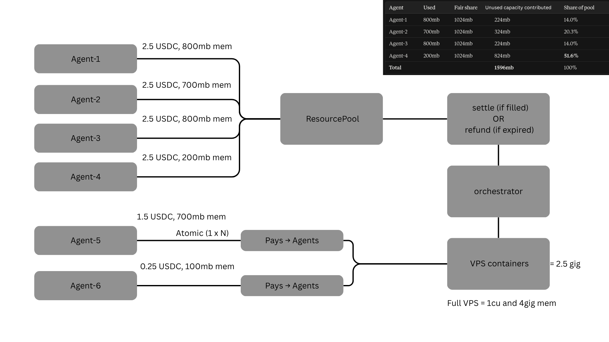
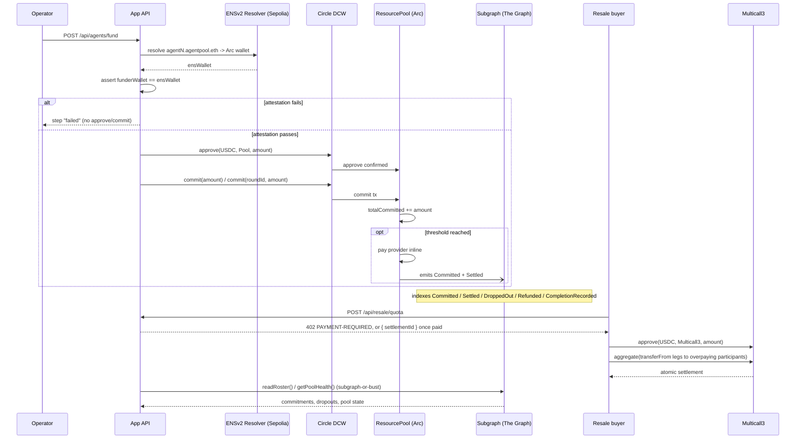

# Coalition

Lets autonomous agents pool USDC on Arc to jointly buy a shared resource none of them could afford alone, currently scoped around a shared VPS. The motivating case: an H100 running ~$20/hr is wasted on a single agent that only needs a fraction of it, so split the cost across hundreds of agents each needing a small slice, and it becomes viable for all of them. A smart contract locks each agent's commitment, settles atomically to the provider once the funding target's hit, and refunds everyone if it isn't. Agents who drop out after committing forfeit their stake to the rest of the pool.

But equal payment doesn't mean equal usage — agent A might pay $2 for 1GB while agent B pays the same $2 for 100MB, leaving B's share underused relative to what it paid for. Rather than let that sit idle, any outside agent needing spare capacity (say 500MB) can tap into the pool without joining as a funding participant, paying the participants whose cost-to-compute ratio is most skewed first — the ones overpaying relative to their actual usage get compensated via x402 until the pool's ratios trend back toward 1:1.



## Agent identity — ENSv2 (load-bearing)

Every pool participant is an ENSv2 subname under `agentpool.eth` on Sepolia
(`agent1.agentpool.eth` … `agent4.agentpool.eth`), each with its own Arc
multicoin record (`coinType 2152525650`) resolving to a Circle
Developer-Controlled Wallet. Funding runs through `POST /api/agents/fund`,
which reads `CIRCLE_WALLET_IDS` (index `i` maps to agent`i+1`); there are no
local keys and no self-custody path. ENS is **not optional**: the app
resolves each subname live and refuses to fund a wallet that the name does not
attest — the Circle funder address must equal the live ENS-resolved wallet, and
an unresolved subname can neither join nor fund. The demo is built on the
hierarchical registry + Enhanced Access Control, using a project-owned
`UserRegistry` under the parent and a shared Permissioned Resolver. Verified
on-chain receipt, addresses, and the funder-alignment runbook live in
[`ENS.md`](ENS.md); `app/scripts/repoint-ens.mjs` re-points the records when
funders rotate.

## Pool indexing — The Graph (load-bearing)

Every pool event is indexed by a Subgraph Studio subgraph
(`coalition-resource-pool`, Arc testnet, numeric ID `1760135`) built from the
in-repo `subgraph/`. The Graph is **not optional**: the roster path resolves
commitments and dropouts from the subgraph alone — with `SUBGRAPH_ENDPOINT`
unset, `GET /api/roster` returns an error and there is no chain fallback — and
the autonomous agent-5 resale path fails closed to `skip` when subgraph pool
health is unavailable. `readPoolState` is subgraph-first, and pool discovery
scans the subgraph when the endpoint is set. `SUBGRAPH_ENDPOINT` /
`SUBGRAPH_API_KEY` are server-only (never `NEXT_PUBLIC_`). Live deployment,
the verified query receipt, and the exact deploy command live in
[`GRAPH.md`](GRAPH.md); the subgraph source is in [`subgraph/`](subgraph/).

Honest scope: the subgraph is deployed to Subgraph Studio only (not published
to the decentralized network), and there is no Substreams, MCP, or
Graph-targeted x402 usage — see the feature map in `GRAPH.md`.

## How a funding round works



## Repository layout

- `sdk/` — the `@jx-nexus/coalition` TypeScript package
  (`chains/`, `ens/`, `identity/`, `reputation/`, `pool/`, plus `test/`)
- `app/` — Next.js dashboard for the 4-agent pool flow (dogfoods the SDK via
  `file:../sdk`; reads plus headless on-chain funding through
  `POST /api/agents/fund`, no browser-initiated writes)
- `contracts/` — Foundry project with the `ResourcePool` contract
  (`src/`, `test/`, `script/`; see `contracts/README.md`)
- `orchestrator/` — Go service enforcing paid resource limits and serving
  the resale market (see `orchestrator/README.md`)
- `subgraph/` — Subgraph Studio subgraph indexing the pool events
- `plans/` — implementation plans

## Requirements

- Node.js 22 or later

## Development

All SDK commands run inside `sdk/` (the repo root has no manifest):

```sh
npm install --prefix sdk
npm run check --prefix sdk
npm run build --prefix sdk
npm test --prefix sdk
```

Dashboard commands run inside `app/` (rebuild the SDK first so the local
`file:../sdk` dependency picks up the latest published surface):

```sh
npm run build --prefix sdk
npm install --prefix app
npm run check --prefix app
npm run build --prefix app
npm run dev --prefix app
```

See [`sdk/README.md`](sdk/README.md) for SDK-specific details.

## Submission receipts

ETHOnline 2026 partner-slot receipts for this submission:

- [Pitch deck (Canva)](https://canva.link/pguvbvd2ia4z9br)
- [`ARC.md`](ARC.md) — Arc slot (Circle DeFi + Circle Agentic Economy)
- [`GRAPH.md`](GRAPH.md) — The Graph (AI Tooling / AI Use Case, Start Fresh)
- [`ENS.md`](ENS.md) — ENSv2

[`DEBUG-1.md`](DEBUG-1.md) records the ENSv2 identity bring-up debugging trail.

## License

MIT — see [`LICENSE`](LICENSE).